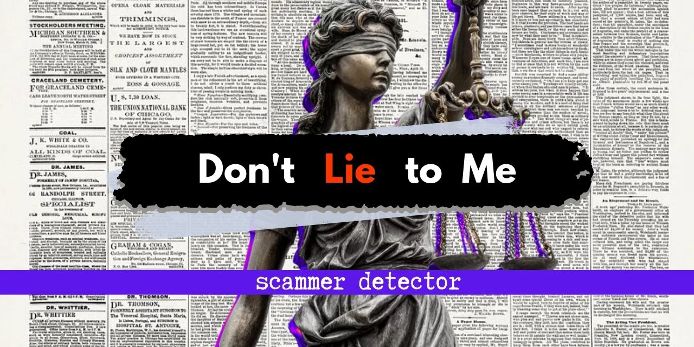
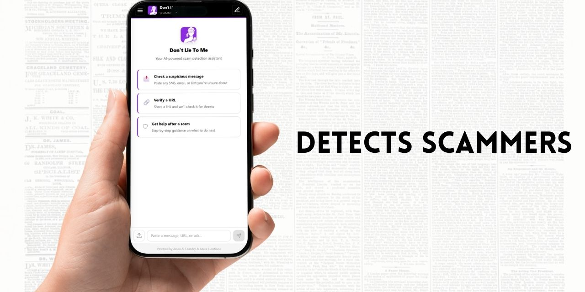
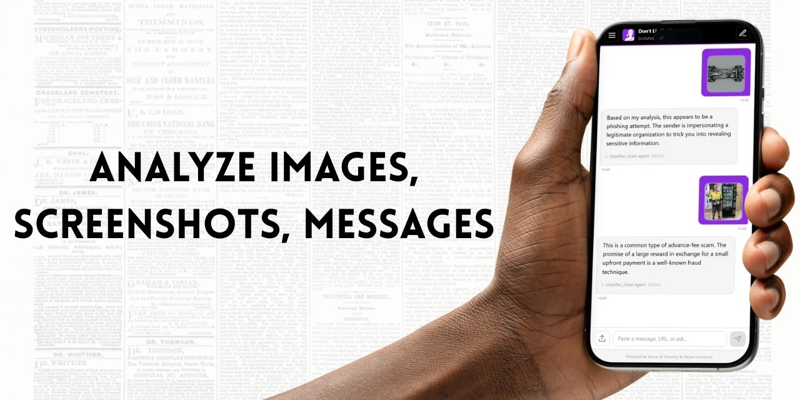
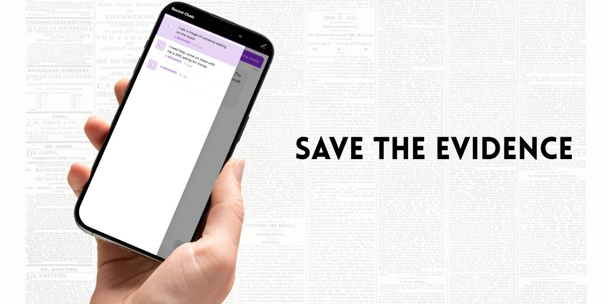

<p align="center">
  
</p>

<h1 align="center">Don't Lie To Me – Azure</h1>

<p align="center">
  An Azure-native anti-scam assistant that helps users identify potential scams,
  analyse suspicious messages and images, and receive actionable safety guidance — powered by
  <strong>Azure AI Foundry</strong> and <strong>Azure Functions</strong>.
</p>

<p align="center">
  
  
  
  
  
  
</p>

---

<p align="center">
  
</p>

<p align="center">
  <em>Don't Lie To Me is an app designed to provide the support needed by everyone who wants to uncover potential scams from their phone. Whether it's a call, a text message, an SMS, a social media post you never really know. The idea is that it's always better to ask first. That's why we're making this tool available to everyone.</em>
</p>

<p align="center">
  
</p>

<p align="center">
  <em>We can analyze images and tell you how likely they are to be fake and advise you on what to do next. Take a screenshot and find out if what you're seeing is real. A familiar face generated by a computer? We can detect that too. What about that text message? If it's an SMS, contains a suspicious link, or shows a phone number we'll review it for you and tell you what to do.</em>
</p>

<p align="center">
  
</p>

<p align="center">
  <em>Want to report a scam? Need proof? Want to show the evidence or just show someone how bold the scam attempt was? You can do that too. This becomes your personal record, helping you stay safe and inform the people you care about most.</em>
</p>

---

## Features

### Core Analysis
- **Scam Classification** – Labels a message as `SCAM`, `LIKELY_SCAM`, `SUSPICIOUS`, or `SAFE` with confidence score and reasoning
- **Detailed Analysis** – Surfaces red flags, persuasion techniques, and impersonation indicators
- **Safety Guidance** – Generates step-by-step advice: immediate actions, reporting steps, prevention tips, and resources (Australian context: Scamwatch, ACCC, etc.)
- **Sentiment & Manipulation Detection** – Analyses emotional pressure, manipulation techniques, urgency indicators, and language patterns with a risk assessment score

### Image Forensics
- **Image Authenticity Analysis** – Upload screenshots or images to detect manipulation, AI-generated content, and deepfakes using GPT-4o Vision (multimodal)
- **Manipulation Detection** – Identifies text editing, font inconsistencies, pixel artifacts, UI/platform inconsistencies in chat screenshots (WhatsApp, iMessage, banking apps, etc.)
- **AI-Generated Image Detection** – Detects artifacts from DALL-E, Midjourney, Stable Diffusion: unnatural textures, impossible lighting, text anomalies
- **Deepfake Detection** – Analyses face/hair/neck boundaries, lighting mismatches, skin texture uniformity, and other deepfake indicators
- **EXIF Metadata Analysis** – Extracts and analyses image metadata when available (editing software detection, compression anomalies). Works without EXIF (common for messaging apps)
- **Smart Resize** – Automatically resizes large images (>2048px) with Pillow before sending to GPT-4o to reduce token cost

### Platform Features
- **URL Threat Intelligence** – Multi-source URL checking with risk scoring
- **Multi-language Support** – English, Spanish, French, German (backend-driven i18n)
- **Analysis History** – Session-based history with Cosmos DB persistence
- **Export Reports** – Download analysis history as CSV or PDF
- **User Feedback** – Thumbs up/down feedback collection on analysis accuracy
- **Microsoft Teams Alerts** – Automatic webhook notification when scams are detected
- **GDPR Compliance** – Right to erasure and data portability endpoints
- **Caching** – Azure Redis for response caching (SHA-256 key hashing)
- **Mock Provider** – Full local development without Azure credentials (`AI_PROVIDER=mock`)

---

## Architecture

### High-Level (v5.0)

See the full Mermaid diagram: [docs/architecture_v5.mmd](docs/architecture_v5.mmd)

```
                    ┌───────────────────────┐
                    │   Azure Static Web    │  CDN · Auto SSL
                    │   Apps                │  API Proxy → /api/*
                    └──────────┬────────────┘
                               │
               ┌───────────────┴───────────────┐
               │                               │
    ┌──────────▼──────────┐         ┌──────────▼───────────┐
    │  Blazor WASM        │         │  Azure Functions     │
    │  .NET 8.0 Standalone│         │  Python 3.11         │
    │                     │         │                      │
    │  Chat-first UI      │ ──────► │  /api/chat (primary) │
    │  Mobile-first PWA   │  POST   │  Agent Orchestrator  │
    │  Brand: #8A2BE2     │ /chat   │  7+ Specialist Agents│
    │  SEO · Open Graph   │         │  GPT-4o · Vision     │
    └─────────────────────┘         └─────┬────────────────┘
                                          │
             ┌────────────────────────────┼──────────────┐
             ▼                            ▼              ▼
       ┌──────────┐              ┌──────────┐     ┌──────────┐
       │Azure AI  │              │Cosmos DB │     │Redis     │
       │Foundry   │              │NoSQL     │     │Cache     │
       │GPT-4o    │              │History   │     │30min TTL │
       └──────────┘              └──────────┘     └──────────┘
```

### Image Forensics Pipeline

```
                    ┌──────────────────┐
                    │  POST /analyze-  │
                    │  image           │
                    │  (base64 data    │
                    │   URI input)     │
                    └────────┬─────────┘
                             │
                    ┌────────▼─────────┐
                    │  Pillow          │
                    │  - Resize <=2048 │
                    │  - EXIF extract  │
                    │  - Format detect │
                    └────────┬─────────┘
                             │
                    ┌────────▼─────────┐
                    │  GPT-4o Vision   │
                    │  (Multimodal)    │
                    │                  │
                    │  Analyses:       │
                    │  . Text editing  │
                    │  . Pixel artifacts│
                    │  . UI consistency│
                    │  . AI generation │
                    │  . Deepfake      │
                    │  . Platform ID   │
                    └────────┬─────────┘
                             │
                    ┌────────▼─────────┐
                    │  Merged Result   │
                    │  Vision + EXIF   │
                    │                  │
                    │  Verdicts:       │
                    │  AUTHENTIC       │
                    │  LIKELY_MANIPULATED│
                    │  MANIPULATED     │
                    │  AI_GENERATED    │
                    │  DEEPFAKE        │
                    │  INCONCLUSIVE    │
                    └──────────────────┘
```

### Frontend Structure (Blazor WASM)

```
src/frontend-blazor/DontLieToMe.Web/
├── Program.cs                          # DI, HttpClient, service registration
├── App.razor / _Imports.razor          # Root component, global usings
├── Layout/
│   └── MainLayout.razor                # Header (DLM brand) + main + footer
├── Pages/
│   └── ChatPage.razor                  # "/" — Unified chat interface
├── Components/Chat/
│   ├── ChatPanel.razor                 # Message list + input container
│   ├── ChatInput.razor                 # Textarea + image upload + send
│   ├── UserMessage.razor               # User message bubble (right-aligned)
│   ├── AssistantMessage.razor          # Assistant bubble + DataCard + Trace
│   ├── WelcomeMessage.razor            # Onboarding hints (clickable)
│   ├── DataCard.razor                  # Polymorphic data renderer
│   ├── TracePanel.razor                # Agent trace (route, duration)
│   └── TypingIndicator.razor           # Animated dots
├── Models/                             # ChatRequest, ChatResponse, etc.
├── Services/
│   ├── IApiClient.cs / ApiClient.cs    # HTTP client → /api/chat
│   ├── AppState.cs                     # Reactive state (conversation, images)
│   └── SessionService.cs              # LocalStorage persistence
└── wwwroot/
    ├── index.html                      # SEO, Open Graph, Twitter Cards, JSON-LD
    ├── css/app.css                     # Design system (CSS custom properties)
    ├── js/interop.js                   # Clipboard, drag-drop, auto-scroll
    ├── manifest.webmanifest            # PWA: "Scam Detector"
    ├── favicon.svg / *.png             # Brand icons (DLM Lady Justice)
    └── og-image.png                    # Open Graph preview image
```

### Backend Module Structure

```
src/backend/
├── function_app.py              # Entry point – HTTP routes + timer trigger
├── host.json                    # Azure Functions v2 runtime config
├── requirements.txt             # Python dependencies
├── prompts.yaml                 # Centralized AI prompt configuration
│
├── shared/                      # Core utilities
│   ├── ai_client.py             # Azure AI Foundry wrapper (text + vision)
│   ├── prompts.py               # YAML prompt loader
│   ├── config.py                # Environment variable access
│   ├── keyvault.py              # Key Vault secret helper
│   ├── url_checker.py           # URL threat intelligence
│   ├── models.py                # Pydantic request/response models
│   ├── risk_hints.py            # URL risk scoring hints
│   └── threat_intel_sources.py  # Threat intelligence source configs
│
├── services/                    # Business logic layer
│   ├── image_analysis_service.py # Image forensics orchestrator (Vision + Pillow)
│   ├── sentiment_service.py     # Sentiment & manipulation analysis
│   ├── cosmos_service.py        # Cosmos DB CRUD operations
│   ├── cache_service.py         # Redis cache wrapper
│   ├── telemetry.py             # Application Insights metrics
│   ├── export_service.py        # CSV/PDF report generation
│   ├── gdpr_service.py          # GDPR compliance (erasure + export)
│   ├── audit_logger.py          # GDPR audit logging
│   ├── teams_integration.py     # MS Teams webhook notifications
│   └── scam_patterns.py         # Text similarity matching
│
├── i18n/                        # Internationalization
│   └── translations.py          # Language bundles (en, es, fr, de)
│
└── tests/                       # Unit & integration tests
    ├── test_functions.py         # HTTP endpoint tests
    ├── test_image_analysis.py    # Image analysis tests (22 tests)
    ├── test_cosmos_service.py    # Cosmos DB service tests
    ├── test_url_checker.py       # URL checker tests
    └── test_mcp_tools.py         # MCP tool tests
```

---

## API Reference

### Core Analysis Endpoints

| Method | Path | Description |
|--------|------|-------------|
| `POST` | `/api/classify` | Quick scam classification (SCAM / LIKELY_SCAM / SUSPICIOUS / SAFE) |
| `POST` | `/api/analyze` | Detailed analysis (red flags, persuasion techniques, impersonation) |
| `POST` | `/api/guidance` | Safety guidance (actions, reporting, prevention, resources) |
| `POST` | `/api/sentiment` | Sentiment & manipulation detection (emotions, pressure, risk) |
| `POST` | `/api/analyze-image` | Image authenticity analysis (manipulation, AI-gen, deepfake) |
| `POST` | `/api/check-url` | URL threat intelligence check |
| `GET` | `/api/health` | Liveness probe (no auth) |

### Data & Compliance Endpoints

| Method | Path | Description |
|--------|------|-------------|
| `GET` | `/api/history` | Session analysis history |
| `GET` | `/api/export` | Export history as CSV or PDF |
| `POST` | `/api/feedback` | Submit analysis accuracy feedback |
| `GET` | `/api/i18n` | Get translation bundle for a language |
| `DELETE` | `/api/gdpr/delete` | GDPR right to erasure |
| `GET` | `/api/gdpr/export` | GDPR data portability |
| `POST` | `/api/notify-teams` | Send scam alert to Microsoft Teams |

### Example: Image Analysis

**Request**
```json
{
  "image": "data:image/png;base64,iVBORw0KGgo...",
  "session_id": "optional-uuid"
}
```

**Response**
```json
{
  "authenticity_score": 0.35,
  "verdict": "LIKELY_MANIPULATED",
  "manipulation_indicators": [
    {
      "type": "text_editing",
      "description": "Font inconsistency in chat bubble",
      "confidence": 0.85
    }
  ],
  "visual_analysis": {
    "text_consistency": "Mixed font rendering detected",
    "font_analysis": "Two different font families in message area",
    "layout_anomalies": "Chat bubble spacing irregular",
    "pixel_artifacts": "Compression artifacts around edited region",
    "lighting_consistency": "Consistent"
  },
  "ai_generation_analysis": {
    "is_ai_generated": false,
    "confidence": 0.1,
    "generator_hints": "UNKNOWN",
    "artifacts_found": [],
    "deepfake_indicators": []
  },
  "context_analysis": {
    "platform_identified": "WhatsApp",
    "expected_vs_actual": "UI mostly consistent with WhatsApp iOS",
    "suspicious_patterns": ["Edited amount in transfer message"]
  },
  "metadata_analysis": {
    "exif_present": false,
    "editing_software_detected": null,
    "metadata_anomalies": ["No EXIF metadata (common for screenshots)"],
    "image_format": "PNG",
    "image_size": {"width": 1170, "height": 2532}
  },
  "summary": "Image shows signs of text editing in a WhatsApp conversation screenshot..."
}
```

### Example: Scam Classification

**Request**
```json
{ "text": "Your account has been compromised. Click here to verify." }
```

**Response**
```json
{
  "classification": "SCAM",
  "confidence": 0.97,
  "reasoning": "Classic phishing attempt using urgency and fear..."
}
```

### Example: Sentiment Analysis

**Request**
```json
{ "text": "ACT NOW or your account will be permanently closed!" }
```

**Response**
```json
{
  "sentiment": {
    "primary_emotion": "urgency",
    "emotion_scores": {"fear": 0.8, "urgency": 0.95, "greed": 0.1, "trust": 0.05, "curiosity": 0.1},
    "overall_tone": "threatening"
  },
  "manipulation": {
    "techniques_detected": ["Authority", "Scarcity", "Fear appeal"],
    "pressure_score": 0.9,
    "urgency_indicators": ["ACT NOW", "permanently closed"],
    "authority_claims": [],
    "emotional_triggers": ["Fear of loss"]
  },
  "language_analysis": {
    "formality_level": "formal",
    "grammar_quality": "moderate",
    "suspicious_phrases": ["ACT NOW", "permanently closed"],
    "call_to_action": "Implicit: take immediate action"
  },
  "risk_assessment": "HIGH",
  "summary": "High-pressure message using fear and urgency tactics..."
}
```

---

## Quick Start (Local)

### Prerequisites

- Python 3.11+
- [Azure Functions Core Tools v4](https://learn.microsoft.com/azure/azure-functions/functions-run-local)
- (Optional) Azure AI Foundry endpoint — not needed with mock provider

### 1 – Install backend dependencies

```bash
cd src/backend
python -m venv .venv
source .venv/bin/activate   # Linux/macOS
.venv\Scripts\activate      # Windows
pip install -r requirements.txt
```

### 2 – Configure for local development (mock mode)

```bash
cp local.settings.json.example local.settings.json
```

Edit `local.settings.json` and set:
```json
{
  "Values": {
    "AI_PROVIDER": "mock"
  }
}
```

This enables the mock provider — all endpoints return realistic simulated responses without needing Azure credentials.

### 3 – Start the Function App

```bash
func start
```

Available at `http://localhost:7071/api/`.

### 4 – Start the Blazor frontend

```bash
cd src/frontend-blazor/DontLieToMe.Web
dotnet run
# Open http://localhost:5000
```

> **Note:** The vanilla JS frontend (`src/frontend/`) is still available as a legacy option via `python -m http.server 8080`.

### 5 – Test an endpoint

```bash
curl -X POST http://localhost:7071/api/classify \
  -H "Content-Type: application/json" \
  -d '{"text": "Your account has been compromised"}'
```

---

## Environment Variables

| Variable | Required | Description |
|----------|----------|-------------|
| `AI_PROVIDER` | No | Provider: `azure` (default), `github`, or `mock` |
| `AZURE_AI_ENDPOINT` | Yes* | Azure AI Foundry endpoint URL (*not needed for mock) |
| `AZURE_AI_DEPLOYMENT_NAME` | No | Model deployment name (default: `gpt-4o`) |
| `AZURE_AI_API_KEY` | Yes* | API key (*omit for managed identity or mock) |
| `AZURE_AI_API_VERSION` | No | API version (default: `2024-02-01`) |
| `COSMOS_DB_CONNECTION_STRING` | No | Cosmos DB connection (falls back gracefully) |
| `COSMOS_DB_ENDPOINT` | No | Cosmos DB endpoint (alternative to connection string) |
| `COSMOS_DB_KEY` | No | Cosmos DB key |
| `COSMOS_DB_DATABASE` | No | Database name (default: `antiscam`) |
| `COSMOS_DB_CONTAINER` | No | Container name (default: `analyses`) |
| `AZURE_REDIS_CONNECTION_STRING` | No | Redis cache connection (optional, graceful fallback) |
| `TEAMS_WEBHOOK_URL` | No | MS Teams incoming webhook URL |
| `AZURE_KEYVAULT_URL` | No | Key Vault URL for production secrets |

---

## Testing

```bash
cd src/backend
python -m pytest tests/ -v
```

**Test coverage includes:**
- HTTP endpoint tests (health, classify, analyze, guidance)
- Image analysis tests (22 tests: vision, metadata, resize, endpoint validation)
- Cosmos DB service tests
- URL threat checker tests
- MCP tool tests

---

## Technology Stack

| Component | Technology | Purpose |
|-----------|-----------|---------|
| Frontend | Blazor WebAssembly (.NET 8.0) | Chat-first PWA — mobile-first responsive, SEO, Open Graph |
| Backend API | Azure Functions v2 (Python 3.11) | REST endpoints, agent orchestration, timer triggers |
| Agent Runtime | Framework-agnostic Python | Deterministic orchestration with 7+ specialist agents |
| AI Model | Azure AI Foundry (GPT-4o) | Text classification, analysis, guidance, multimodal vision |
| Image Processing | Pillow (PIL) + GPT-4o Vision | EXIF extraction, resize, manipulation/deepfake/AI detection |
| Prompt System | `prompts.yaml` + YAML loader | Centralized AI prompts with fallback pattern |
| Database | Azure Cosmos DB (NoSQL) | Analysis history, feedback, session data |
| Cache | Azure Cache for Redis | Response caching with SHA-256 keys |
| Secrets | Azure Key Vault | API keys and connection strings |
| Monitoring | Application Insights | Telemetry, metrics, agent traces |
| Hosting | Azure Static Web Apps | CDN, auto SSL, API proxy to Functions |
| Infrastructure | Bicep | Repeatable IaC templates |
| CI/CD | GitHub Actions | Backend pytest + Frontend dotnet build |

---

## Deploy to Azure

See [docs/setup.md](docs/setup.md) for the full deployment walkthrough using
Azure CLI and Bicep templates.

```bash
az deployment sub create \
  --location australiaeast \
  --template-file infra/main.bicep \
  --parameters environmentName=dev aiDeploymentName=gpt-4o
```

---

## Documentation

- [Architecture Overview](docs/architecture.md) – Detailed system diagram and component breakdown
- [Architecture Diagram (Mermaid)](docs/architecture_v5.mmd) – v5.0 Blazor WASM + Agent Orchestration
- [Setup & Deployment Guide](docs/setup.md) – Full Azure deployment walkthrough
- [Contributing Guide](docs/CONTRIBUTING.md) – Development workflow and prompt management

---

## Contributing

Contributions are welcome! Please read [docs/CONTRIBUTING.md](docs/CONTRIBUTING.md)
before opening a pull request.

---

## License

Apache License 2.0 – see [LICENSE](LICENSE) for details.
