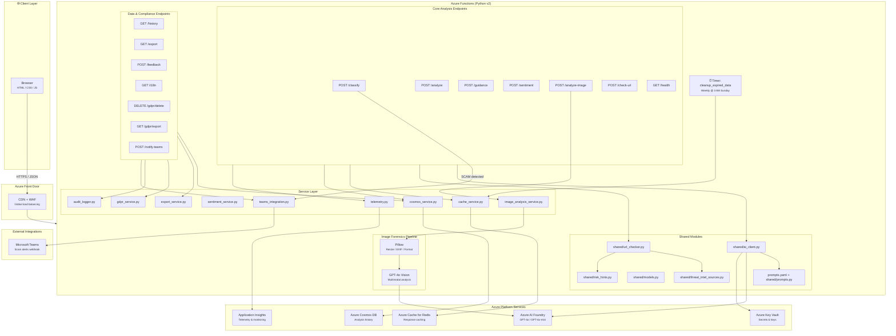

# Architecture Overview

## System Diagram (v3.1)



## Components

| Component | Technology | Purpose |
|-----------|-----------|---------|
| Frontend | HTML5 / Vanilla JS / CSS | User interface – paste text, upload screenshots, view results |
| Backend API | Azure Functions v2 (Python 3.11) | REST endpoints, orchestration, timer triggers |
| AI Model | Azure AI Foundry (GPT-4o) | Text classification, analysis, guidance, multimodal vision |
| Image Processing | Pillow (PIL) | EXIF extraction, image resize, format detection |
| Prompt System | `prompts.yaml` + loader | Centralized AI system prompts with fallback pattern |
| Database | Azure Cosmos DB (NoSQL) | Analysis history, feedback, session data |
| Cache | Azure Cache for Redis | Response caching with SHA-256 key hashing |
| Secret management | Azure Key Vault | Securely store API keys and connection strings |
| Telemetry | Azure Application Insights | Logging, tracing, performance monitoring |
| CDN/WAF | Azure Front Door | Global load balancing, DDoS protection |
| Infrastructure | Bicep | Repeatable, version-controlled IaC |

## Prompt Management Architecture

The system uses a **centralized prompt configuration** to enable rapid iteration without code changes:

- **`prompts.yaml`**: Single source of truth for all AI system prompts, model settings, temperature, and token limits
- **`shared/prompts.py`**: Loader module with PyYAML for runtime configuration
- **Fallback pattern**: Each service contains an embedded `_FALLBACK_SYSTEM_PROMPT` constant for operational resilience

**Benefits:**
- Prompt engineers can iterate without deploying code
- Version control for prompt evolution
- Graceful degradation if YAML is missing or malformed
- Consistent model selection and temperature settings

**Example workflow:**
1. Edit `prompts.yaml` to tune scam detection behavior
2. Test locally via Azure Functions
3. Commit YAML changes (no Python code modified)
4. Deploy with confidence - fallback ensures stability

See [CONTRIBUTING.md](CONTRIBUTING.md#ai-prompt-management) for detailed editing guidelines.

## API Endpoints

### `POST /api/classify`
Quickly classifies a message as `SCAM`, `LIKELY_SCAM`, `SUSPICIOUS`, or `SAFE`.

**Request**
```json
{ "text": "<message>" }
```
**Response**
```json
{
  "classification": "SCAM",
  "confidence": 0.95,
  "reasoning": "..."
}
```

---

### `POST /api/analyze`
Performs a detailed breakdown of red flags, persuasion techniques, and impersonation indicators.

**Request**
```json
{ "text": "<message>" }
```
**Response**
```json
{
  "red_flags": ["Urgency language", "..."],
  "persuasion_techniques": ["Fear appeal", "..."],
  "impersonation_indicators": ["Claims to be HMRC", "..."],
  "summary": "..."
}
```

---

### `POST /api/guidance`
Returns step-by-step safety guidance for the user.

**Request**
```json
{ "text": "<message>", "context": "<optional>" }
```
**Response**
```json
{
  "immediate_actions": ["Do not click any links", "..."],
  "reporting_steps": ["Report to Action Fraud", "..."],
  "prevention_tips": ["..."],
  "resources": ["https://www.actionfraud.police.uk/", "..."]
}
```

---

### `POST /api/sentiment`
Analyses sentiment, emotional manipulation, and language patterns.

**Request**
```json
{ "text": "<message>" }
```
**Response**
```json
{
  "sentiment": {
    "primary_emotion": "urgency",
    "emotion_scores": {"fear": 0.8, "urgency": 0.95, "greed": 0.1, "trust": 0.05, "curiosity": 0.1},
    "overall_tone": "threatening"
  },
  "manipulation": {
    "techniques_detected": ["Authority", "Scarcity"],
    "pressure_score": 0.9,
    "urgency_indicators": ["ACT NOW"],
    "authority_claims": [],
    "emotional_triggers": ["Fear of loss"]
  },
  "language_analysis": {
    "formality_level": "formal",
    "grammar_quality": "moderate",
    "suspicious_phrases": ["ACT NOW"],
    "call_to_action": "Click the link"
  },
  "risk_assessment": "HIGH",
  "summary": "..."
}
```

---

### `POST /api/analyze-image`
Analyses an uploaded image for signs of manipulation, AI generation, or deepfake using GPT-4o Vision.

**Request**
```json
{
  "image": "data:image/png;base64,iVBORw0KGgo...",
  "session_id": "optional-uuid"
}
```
**Response**
```json
{
  "authenticity_score": 0.35,
  "verdict": "LIKELY_MANIPULATED",
  "manipulation_indicators": [
    {"type": "text_editing", "description": "Font inconsistency", "confidence": 0.85}
  ],
  "visual_analysis": {
    "text_consistency": "...",
    "font_analysis": "...",
    "layout_anomalies": "...",
    "pixel_artifacts": "...",
    "lighting_consistency": "..."
  },
  "ai_generation_analysis": {
    "is_ai_generated": false,
    "confidence": 0.1,
    "generator_hints": "UNKNOWN",
    "artifacts_found": [],
    "deepfake_indicators": []
  },
  "context_analysis": {
    "platform_identified": "WhatsApp",
    "expected_vs_actual": "...",
    "suspicious_patterns": ["..."]
  },
  "metadata_analysis": {
    "exif_present": false,
    "editing_software_detected": null,
    "metadata_anomalies": ["No EXIF metadata"],
    "image_format": "PNG",
    "image_size": {"width": 1170, "height": 2532}
  },
  "summary": "..."
}
```

**Verdicts:** `AUTHENTIC`, `LIKELY_MANIPULATED`, `MANIPULATED`, `AI_GENERATED`, `DEEPFAKE`, `INCONCLUSIVE`

**Limits:** Max image size 10 MB. Images >2048px are automatically resized.

---

### `GET /api/health`
Unauthenticated liveness probe. Returns `{"status": "ok"}`.

## Security Considerations

- All function endpoints (except `/health`) require a **function key** by default.
- Secrets are stored in **Azure Key Vault** and accessed via the Function App's system-assigned managed identity.
- The frontend never handles API keys directly.
- HTTPS is enforced on the Function App.
- Storage accounts use TLS 1.2 minimum and no public blob access.
